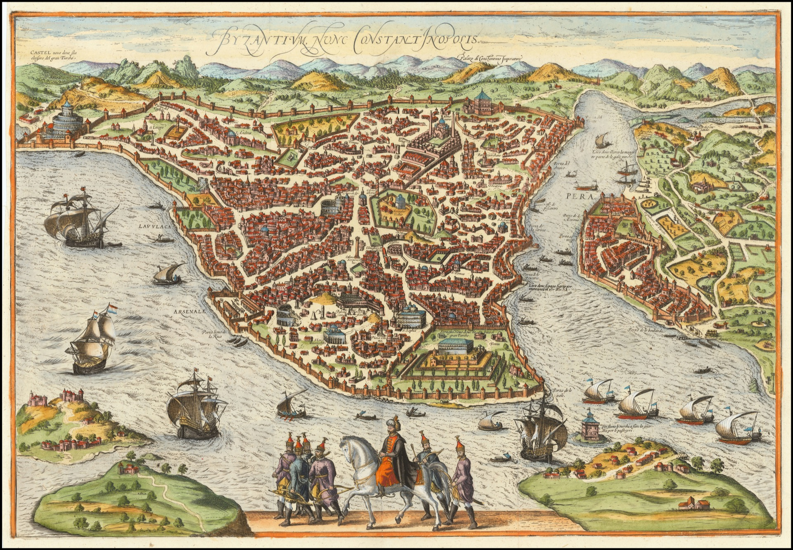
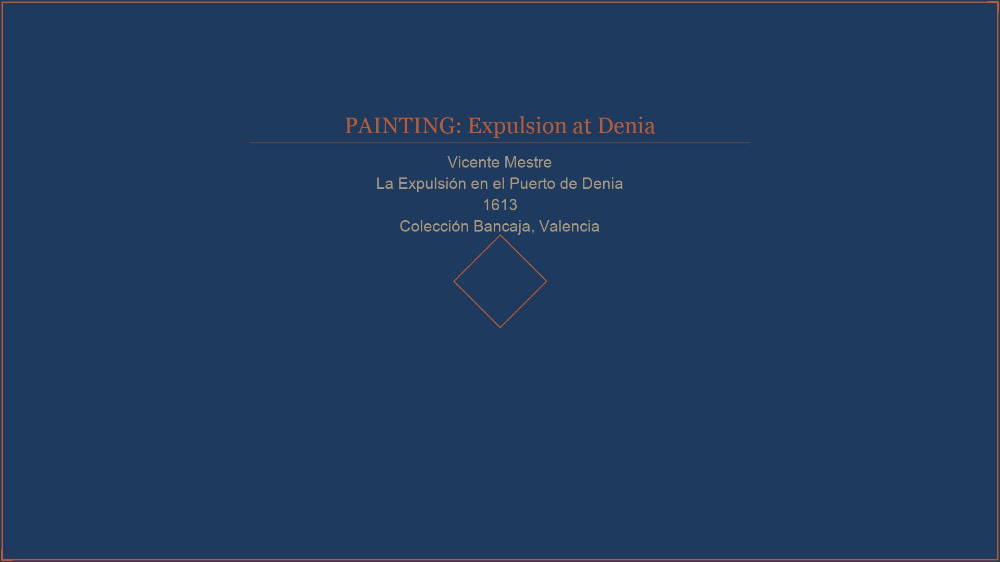

# AGENTS.md — Persistent Rules for All AI Agents

**Project:** Morisco Thesis Portfolio Website
**Repository:** `doganyunus/morisco-thesis` → deployed at `doganyunus.github.io/morisco-thesis`
**Reference documents:** `plan.md` (architecture, design, animations) · `research.md` (historical content)

> These rules apply to every file in this repository. Read this file in full before making any change. Rules in this file take precedence over any general training or default behaviour.

---

## 1. Project Summary

This website presents the PhD dissertation *Moriscos and the Ottoman Empire: Entangled Histories in the Early Modern Mediterranean (1520–1620)* by Yunus Doğan (European University Institute, Florence, 2026) as a visual scrollytelling experience for an academic but non-specialist audience. The Moriscos were Muslims forcibly converted then expelled from Spain (1609–1614) — approximately 300,000 people displaced across the Mediterranean — and their strategies of diplomacy, espionage, mobility, and conversion in relation to the Ottoman Empire form the core of the research. The site connects this sixteenth-century history to contemporary debates on refugee integration, religious minorities in Europe, and the entangled histories of Europe, Africa, and Asia.

---

## 2. Tech Stack — Hard Constraints

### Permitted

| Technology | Version / Source | Purpose |
|-----------|-----------------|---------|
| HTML5 | — | All markup |
| CSS3 | — | All styling |
| Vanilla JavaScript (ES2020+) | — | All interactivity |
| GSAP | 3.12.5 via CDN | Scroll animations |
| ScrollTrigger | 3.12.5 via CDN (GSAP plugin) | Scroll-driven triggers |
| Google Fonts | Via `<link>` in `<head>` | Typography only |

### Forbidden — never do any of the following

- **No npm, yarn, pnpm, or bun.** Do not create `package.json`, `package-lock.json`, `node_modules/`, or any lock file.
- **No build steps.** No webpack, Vite, Parcel, Rollup, esbuild, or any bundler.
- **No frameworks.** No React, Vue, Svelte, Angular, Astro, or any component framework.
- **No CSS frameworks.** No Tailwind, Bootstrap, Bulma, or similar.
- **No additional JS libraries** beyond GSAP + ScrollTrigger. No jQuery, Lodash, Alpine.js, etc.
- **No server-side code.** No Node.js, Python, PHP, or any backend. This is a static site.
- **No localhost-dependent tooling.** Do not write instructions that require a dev server to function. The site must open correctly from the filesystem (`file://`) and from GitHub Pages.
- **No TypeScript.** Plain `.js` files only.

### CDN links — use exactly these, in this order, at the bottom of `<body>`

```html
<script src="https://cdnjs.cloudflare.com/ajax/libs/gsap/3.12.5/gsap.min.js"></script>
<script src="https://cdnjs.cloudflare.com/ajax/libs/gsap/3.12.5/ScrollTrigger.min.js"></script>
<script src="js/main.js" defer></script>
```

Do not use any other CDN URL for GSAP. Do not add integrity hashes unless you have verified them — leave them out rather than guess.

---

## 3. File Structure — Never Deviate

The repository layout is fixed. Do not create files outside this structure without explicit instruction.

```
morisco-thesis/
├── index.html
├── researcher.html
├── sources.html
├── css/
│   └── main.css
├── js/
│   └── main.js
├── images/
│   ├── hero/
│   ├── maps/
│   ├── portraits/
│   ├── paintings/
│   ├── chapters/
│   └── ui/
└── assets/
    └── favicon/
```

- **One CSS file:** `css/main.css` — all styles for all three pages live here.
- **One JS file:** `js/main.js` — all animations and interactions for all three pages live here.
- **Three HTML files:** `index.html`, `researcher.html`, `sources.html` — no others.
- Do not create `dist/`, `build/`, `src/`, `components/`, or any directory not listed above.

---

## 4. Paths and Links — Relative Only

**This rule has no exceptions.**

- Every `href`, `src`, `srcset`, and `url()` in CSS must be a relative path from the file's own location.
- Never hardcode `https://doganyunus.github.io`, `http://localhost`, `file://`, or any domain.
- Never use absolute paths beginning with `/`.

### Correct examples

```html
<!-- From index.html (root level) -->
<link rel="stylesheet" href="css/main.css">
<script src="js/main.js" defer></script>

<a href="researcher.html">About the Researcher</a>
<a href="sources.html">Sources & Methodology</a>
```

```css
/* In css/main.css */
background-image: url('../images/hero/mediterranean-map-hero.jpg');
background-image: url('../images/ui/parchment-texture.jpg');
```

### Wrong examples — never write these

```html
<!-- WRONG — hardcoded domain -->
<link rel="stylesheet" href="https://doganyunus.github.io/morisco-thesis/css/main.css">

<!-- WRONG — absolute path -->


<!-- WRONG — localhost -->
<script src="http://localhost:3000/js/main.js"></script>
```

---

## 5. Design System — Copy Exactly, Never Improvise

All design tokens are fixed in `plan.md` and must be reproduced exactly. Do not invent new colours, fonts, or spacing values. When adding new UI elements, use only the variables already defined.

### 5.1 Color Custom Properties

These are the only colours permitted in the project. Always use the CSS variable name, never the raw hex value in component styles.

```css
:root {
  /* Palette */
  --color-deep-ocean:    #162039;
  --color-cobalt:        #1E3A5F;
  --color-terracotta:    #B85C38;
  --color-burnt-sienna:  #8B3A22;
  --color-parchment:     #F2E8D5;
  --color-sand:          #E0CEAA;
  --color-ink:           #2A1E14;
  --color-gold:          #C9A84C;
  --color-gold-light:    #E8C97A;
  --color-text-light:    #F0E4CC;
  --color-text-muted:    #A89880;

  /* Semantic aliases — use these in components */
  --color-bg-dark:       var(--color-deep-ocean);
  --color-bg-mid:        var(--color-cobalt);
  --color-bg-light:      var(--color-parchment);
  --color-accent:        var(--color-terracotta);
  --color-highlight:     var(--color-gold);
  --color-text-on-dark:  var(--color-text-light);
  --color-text-on-light: var(--color-ink);
}
```

**Section background alternation rule** — sections must follow this dark/light pattern. Do not break it without explicit instruction:

```
#hero          → dark  (--color-deep-ocean)
#contemporary  → dark  (--color-cobalt)
#context       → light (--color-parchment)
#expulsion     → dark  (full-bleed image with overlay)
#chapter-1     → light (--color-parchment)
#chapter-2     → dark  (--color-cobalt)
#chapter-3     → light (--color-parchment)
#chapter-4     → dark  (full-bleed sea image)
#chapter-5     → light (--color-parchment)
#chapter-6     → dark  (--color-cobalt)
#strategies    → dark  (--color-cobalt)
#figures       → light (--color-parchment)
#maps          → dark  (--color-deep-ocean)
#methodology   → light (--color-parchment)
#about         → dark  (--color-deep-ocean)
footer         → dark  (--color-deep-ocean)
```

### 5.2 Typography Custom Properties

```css
:root {
  --font-serif:  'Cormorant Garamond', Georgia, serif;
  --font-sans:   'Source Sans 3', system-ui, sans-serif;

  /* Fluid type scale */
  --text-hero:        clamp(3rem, 7vw, 6.5rem);
  --text-display:     clamp(2.2rem, 4.5vw, 4rem);
  --text-heading:     clamp(1.6rem, 3vw, 2.4rem);
  --text-subheading:  clamp(1.2rem, 2vw, 1.6rem);
  --text-pullquote:   clamp(1.4rem, 2.5vw, 2rem);
  --text-body:        clamp(1rem, 1.2vw, 1.15rem);
  --text-caption:     0.85rem;
  --text-label:       0.75rem;

  /* Line heights */
  --leading-tight:  1.2;
  --leading-base:   1.6;
  --leading-loose:  1.85;

  /* Letter spacing */
  --tracking-wide:   0.08em;
  --tracking-normal: 0.01em;
}
```

**Typography assignment rules:**
- `--font-serif` (Cormorant Garamond): all `<h1>`–`<h4>`, pull quotes, figure captions
- `--font-sans` (Source Sans 3): all body paragraphs, nav links, labels, metadata, buttons
- Headings on dark sections: `color: var(--color-text-light)`
- Headings on light sections: `color: var(--color-terracotta)` for display headings, `color: var(--color-ink)` for sub-headings
- Body text on dark: `color: var(--color-text-light)`
- Body text on light: `color: var(--color-ink)`
- Pull quotes: `font-style: italic`, `color: var(--color-gold)` on dark sections; `color: var(--color-terracotta)` on light

### 5.3 Spacing Custom Properties

```css
:root {
  --space-xs:   0.5rem;
  --space-sm:   1rem;
  --space-md:   2rem;
  --space-lg:   4rem;
  --space-xl:   7rem;
  --space-xxl:  12rem;

  --container-narrow:  680px;
  --container-mid:     900px;
  --container-wide:    1200px;

  --section-pad-y:  clamp(5rem, 10vw, 10rem);

  --radius-sm:    4px;
  --radius-md:    8px;
  --radius-card:  12px;

  --transition-fast:  0.2s ease;
  --transition-base:  0.4s ease;
  --transition-slow:  0.7s cubic-bezier(0.16, 1, 0.3, 1);
}
```

### 5.4 Image Treatment Rules

| Image type | CSS treatment |
|-----------|--------------|
| Hero backgrounds | Dark overlay: `background: rgba(22, 32, 57, 0.55)` over image |
| Historical maps and paintings | `filter: sepia(15%) contrast(105%)` — unifies varied public domain quality |
| Portrait images | Oval/circular crop; `border: 2px solid var(--color-gold)` |
| All `` elements | `loading="lazy"` except the hero image; `object-fit: cover` |
| Section background images in CSS | `background-size: cover; background-position: center` |

---

## 6. Content Tone and Language

### Do

- Write in a register that is scholarly but accessible to an educated non-specialist — someone who reads long-form journalism or popular history.
- Use field terminology (Morisco, Mudéjar, limpieza de sangre, Sublime Porte, trans-imperial, dragoman) but define each term clearly on first use, either inline or in a tooltip/footnote.
- Draw connections to the present day where they are grounded: the Moriscos as a historical case of refugee policy, integration, and religious discrimination; the fear of Islam in Europe then and now; the entangled histories of the Mediterranean basin.
- Keep pull quotes faithful to primary sources as quoted in the dissertation. Cite author/source in the `<figcaption>`.
- Use the dissertation's own chapter titles and key phrases where possible: "Networks of Trust", "Settling the Stateless", "Crossing the Mediterranean", "Between Two Worlds".

### Do not

- Do not use anachronistic language. Do not call the Moriscos a "Muslim community" in the modern sense without contextualisation. Do not apply contemporary political terms (e.g. "ethnic cleansing", "genocide") without noting this is a historiographical debate.
- Do not simplify to the point of distortion. The Moriscos were not a monolithic group; Morisco–Ottoman relations were not a simple Muslim-vs-Christian story. Preserve this nuance.
- Do not invent quotations or historical facts. All specific claims must come from `research.md` or `plan.md`. If in doubt, use hedged language ("the dissertation argues", "according to archival sources") rather than asserting directly.
- Do not use casual or colloquial register: no "amazing", "incredible", "fascinating", "mind-blowing".
- Do not editorialize on contemporary politics beyond the framed contemporary bridge section in `plan.md`.

### Tone reference phrases (from the dissertation's own language)

These phrasings reflect the project's voice — use as models:

- "…a stateless diaspora navigating complex political, religious, and social landscapes"
- "…sovereignty, faith, and belonging were reshaped through crosscurrents of displacement, diplomacy, and trans-imperial negotiation"
- "…the Mediterranean as a dynamic and interdependent arena of negotiation"
- "…Morisco mobility and interaction redefined notions of sovereignty"
- "…entangled histories of Europe, Africa, and Asia"

---

## 7. Image Rules

### Permitted sources

Only use images that are confirmed as public domain. The following are approved for this project (sourced from `research.md`):

| Filename | Description | Source |
|----------|-------------|--------|
| `braun-hogenberg-constantinople-1572.jpg` | 1572 bird's-eye view of Constantinople | Wikimedia Commons — public domain |
| `piri-reis-andalusia.jpg` | Piri Reis, coastline of Andalusia, 16th c. | Topkapı Palace Museum — public domain |
| `piri-reis-mediterranean.jpg` | Piri Reis, Europe and Mediterranean Sea | Wikimedia Commons — public domain |
| `portolan-1590.jpg` | Joan Riezo portolan chart, 1590 | Wikimedia Commons — public domain |
| `mestre-denia-1613.jpg` | Vicente Mestre, *La Expulsión en el Puerto de Denia*, 1613 | Wikimedia Commons — public domain |
| `oromig-grao-valencia-1616.jpg` | Pere Oromig, *Embarco moriscos en el Grao de Valencia*, 1616 | Wikimedia Commons — public domain |
| `oromig-vinaros-1613.jpg` | Pere Oromig & Francisco Peralta, Moriscos embarking at Vinaròs, 1613 | Public domain |
| `moriscos-elect-king-vierge.jpg` | Daniel Urrabieta y Vierge, *Meeting of the Moriscos to elect the king*, 1851–1904 | Public domain |
| `spy-cesare-ripa-1618.jpg` | Cesare Ripa, image of the spy, *Nova Iconologia*, 1618 | Public domain |
| `philip-ii-titian.jpg` | Philip II of Spain, school of Titian, c.1550s | Wikimedia Commons — public domain |
| `selim-ii.jpg` | Sultan Selim II with servants, Nakkaş Osman, c.1570 | Wikimedia Commons — public domain |
| `sokollu-mehmed-pasha.jpg` | Sokollu Mehmed Pasha, engraving by Dominicus Custos, 1603 | Wikimedia Commons — public domain |
| `kilij-ali-pasha.jpg` | Kılıç Ali Pasha, from Ottoman ms *Nusretname*, 1570s | Wikimedia Commons — public domain |
| `lepanto-map.jpg` | Battle of Lepanto, anonymous, c.1571 | Wikimedia Commons — public domain |

Do not use any image not on this list without verifying its public domain status and adding it to the list above.

### Alt text — mandatory on every image

Every `` tag must have a descriptive `alt` attribute. The alt text must:
- Describe what is shown in the image (subject, period, medium if relevant)
- Not begin with "image of" or "picture of"
- Be 10–150 characters for decorative/background images; full descriptive sentence for content images

```html
<!-- Correct -->


<!-- Correct — decorative image with empty alt -->


<!-- Wrong — missing alt -->


<!-- Wrong — non-descriptive alt -->

```

### Source credit in HTML comment — mandatory

Every `` that displays a historical work must have an HTML comment immediately above it crediting the source:

```html
<!-- Source: Vicente Mestre, "La Expulsión en el Puerto de Denia", 1613.
     Colección Bancaja, Valencia. Public domain. Via Wikimedia Commons. -->

```

### The hero image is exempt from `loading="lazy"`

```html
<!-- Hero image: NO lazy loading — it must be available immediately -->

```

---

## 8. HTML Code Style

### Document structure — every HTML file must begin with exactly this skeleton

```html
<!DOCTYPE html>
<html lang="en">
<head>
  <meta charset="UTF-8">
  <meta name="viewport" content="width=device-width, initial-scale=1.0">
  <title>[Page Title] — Moriscos & the Ottoman Empire</title>
  <meta name="description" content="[Page-specific description, max 155 characters]">

  <meta property="og:title" content="Moriscos & the Ottoman Empire">
  <meta property="og:description" content="Entangled Histories in the Early Modern Mediterranean, 1520–1620. PhD dissertation by Yunus Doğan, EUI Florence, 2026.">
  <meta property="og:image" content="images/hero/mediterranean-map-hero.jpg">

  <link rel="preconnect" href="https://fonts.googleapis.com">
  <link rel="preconnect" href="https://fonts.gstatic.com" crossorigin>
  <link href="https://fonts.googleapis.com/css2?family=Cormorant+Garamond:ital,wght@0,300;0,400;0,600;0,700;1,300;1,400&family=Source+Sans+3:wght@300;400;600&display=swap" rel="stylesheet">

  <link rel="stylesheet" href="css/main.css">
  <link rel="icon" href="assets/favicon/favicon.svg" type="image/svg+xml">
</head>
<body>

  <a class="skip-link" href="#main-content">Skip to main content</a>

  <nav class="site-nav" aria-label="Main navigation">
    <!-- nav -->
  </nav>

  <main id="main-content">
    <!-- page content -->
  </main>

  <footer class="site-footer" aria-label="Site footer">
    <!-- footer -->
  </footer>

  <script src="https://cdnjs.cloudflare.com/ajax/libs/gsap/3.12.5/gsap.min.js"></script>
  <script src="https://cdnjs.cloudflare.com/ajax/libs/gsap/3.12.5/ScrollTrigger.min.js"></script>
  <script src="js/main.js" defer></script>
</body>
</html>
```

### Semantic elements — required assignments

| Element | Use for |
|---------|--------|
| `<main>` | Single per page; wraps all primary content |
| `<nav>` | Site navigation only; must have `aria-label` |
| `<section>` | Each major scroll section in `index.html`; must have a unique `id` and an `aria-label` or contain a heading |
| `<article>` | Self-contained chapter blocks and portrait cards |
| `<figure>` + `<figcaption>` | All images that require a caption (maps, paintings, portraits) |
| `<blockquote>` | All pull quotes from primary or secondary sources |
| `<time>` | All dates and date ranges (e.g. `<time datetime="1609">1609</time>`) |
| `<abbr>` | Abbreviations on first use (e.g. `<abbr title="European University Institute">EUI</abbr>`) |
| `<dl>`, `<dt>`, `<dd>` | Glossary terms and definitions |

### Indentation and formatting

- 2-space indentation throughout
- One blank line between sibling sections
- Attribute order: `id`, `class`, `src`/`href`, `alt`/`aria-*`, `loading`, data attributes
- Self-closing tags for void elements: ``, `<input>`, `<br>`, `<hr>`, `<meta>`, `<link>`

### Section IDs — canonical list for `index.html`

Use only these `id` values for the main scroll sections:

```
hero · contemporary · context · expulsion
chapter-1 · chapter-2 · chapter-3 · chapter-4 · chapter-5 · chapter-6
strategies · figures · maps · methodology · about
```

---

## 9. CSS Code Style

### Custom properties first, always

Never write a raw hex value, pixel count, or font name directly in a component rule. Always define a token in `:root` first and reference the variable. Exception: single-use values inside a GSAP JS call.

```css
/* Correct */
.section-heading {
  font-family: var(--font-serif);
  font-size: var(--text-heading);
  color: var(--color-terracotta);
  margin-bottom: var(--space-md);
}

/* Wrong — raw values in component rules */
.section-heading {
  font-family: 'Cormorant Garamond', serif;
  font-size: 2.4rem;
  color: #B85C38;
  margin-bottom: 2rem;
}
```

### CSS file order

Maintain this section order in `main.css`. Add new rules inside the appropriate section, never at random:

```css
/* 1. Custom properties */
/* 2. CSS reset */
/* 3. Typography base */
/* 4. Layout utilities */
/* 5. Component: Navigation */
/* 6. Component: Buttons and CTAs */
/* 7. Component: Cards */
/* 8. Component: Timeline */
/* 9. Component: Pull quotes */
/* 10. Component: Image treatments */
/* 11–20. Sections (hero, contemporary, context, expulsion, chapters, etc.) */
/* 21. Page: researcher.html overrides */
/* 22. Page: sources.html overrides */
/* 23. Utilities (.reveal, .stagger-children, .skip-link, .visually-hidden) */
/* 24. Media queries */
/* 25. @media (prefers-reduced-motion) */
```

### Reduced motion — always include this block

```css
@media (prefers-reduced-motion: reduce) {
  *, *::before, *::after {
    animation-duration: 0.01ms !important;
    animation-iteration-count: 1 !important;
    transition-duration: 0.01ms !important;
  }
}
```

### Responsive breakpoints — use only these three

```css
/* Mobile first. Styles outside breakpoints apply to all sizes. */
@media (min-width: 768px)  { /* md — 2-column layouts unlock */ }
@media (min-width: 1024px) { /* lg — full desktop layout     */ }
@media (min-width: 1400px) { /* xl — max-width cap           */ }
```

### No inline styles in HTML

Never write `style="..."` attributes on HTML elements. All styling belongs in `css/main.css`. The only exception is GSAP's programmatic inline styles, which are applied by the library at runtime — do not remove or override these manually.

---

## 10. JavaScript Code Style

### File structure — `main.js` must follow this order

```javascript
// ─── 1. Plugin registration ───────────────────────────────────────────────────
gsap.registerPlugin(ScrollTrigger);

// ─── 2. Reduced motion guard ──────────────────────────────────────────────────
const prefersReducedMotion = window.matchMedia('(prefers-reduced-motion: reduce)').matches;

// ─── 3. Navigation: scroll behaviour + active section ─────────────────────────

// ─── 4. Hero: load animations + Ken Burns effect ──────────────────────────────

// ─── 5. Global: .reveal and .stagger-children scroll utilities ────────────────

// ─── 6. Section: Expulsion stat counters ──────────────────────────────────────

// ─── 7. Section: Chapter II route SVG draw ────────────────────────────────────

// ─── 8. Section: Parallax backgrounds (desktop only) ─────────────────────────

// ─── 9. Section: Four Strategies quadrant entrance ────────────────────────────

// ─── 10. Page-specific: researcher.html accordion ─────────────────────────────

// ─── 11. Page-specific: sources.html ─────────────────────────────────────────
```

### Comment every GSAP animation block — mandatory

Every `gsap.from()`, `gsap.to()`, `gsap.fromTo()`, and `ScrollTrigger.create()` call must have a comment block immediately above it explaining:
1. What element is being animated
2. What the animation does
3. When it triggers

```javascript
// Correct ✓
// Hero title — fades in and rises 40px on page load, before scroll begins
gsap.from(".hero-title", {
  opacity: 0,
  y: 40,
  duration: 1.2,
  ease: "power3.out"
});

// Hero background — parallax: drifts down 30% as hero section scrolls out of view
gsap.to(".hero-bg", {
  yPercent: 30,
  ease: "none",
  scrollTrigger: {
    trigger: ".hero",
    start: "top top",
    end: "bottom top",
    scrub: true
  }
});

// Wrong ✗ — no comment
gsap.from(".hero-title", { opacity: 0, y: 40, duration: 1.2 });
```

### Reduced motion guard — wrap all GSAP in this check

```javascript
if (!prefersReducedMotion) {
  // All GSAP animations go inside this block.
  // Users who prefer reduced motion see elements in their final, visible state.
}
```

Elements targeted by GSAP animations must be visible by default (no `opacity: 0` in CSS). GSAP sets the initial hidden state; if JS fails to load, content is still readable.

### Desktop-only parallax via `gsap.matchMedia`

```javascript
// Parallax effects — disabled on mobile to prevent jank
const mm = gsap.matchMedia();
mm.add("(min-width: 768px)", () => {
  // parallax animations here
});
```

### No `console.log` in committed code

Remove all `console.log`, `console.warn`, and `console.error` calls before committing. Use them freely during development but clean up before pushing.

### Event listeners — use `DOMContentLoaded` guard

```javascript
document.addEventListener('DOMContentLoaded', () => {
  // All DOM-dependent code goes here
});
```

---

## 11. Accessibility — Non-Negotiable Requirements

Every HTML file must comply with WCAG 2.1 Level AA. The following items are checked on every build:

| Requirement | Implementation |
|------------|----------------|
| Skip link | `<a class="skip-link" href="#main-content">Skip to main content</a>` as the first element inside `<body>` |
| Language attribute | `<html lang="en">` on every page |
| Landmark roles | `<main>`, `<nav aria-label="...">`, `<footer>` on every page |
| Heading hierarchy | One `<h1>` per page; `<h2>` for section titles; `<h3>` for sub-sections; never skip levels |
| Alt text | All `` elements have `alt`; decorative images have `alt=""` and `role="presentation"` |
| Colour contrast | Text on dark backgrounds: minimum 4.5:1 ratio. `#F0E4CC` on `#162039` = ~13:1 ✓. `#F0E4CC` on `#1E3A5F` = ~9:1 ✓. `#2A1E14` on `#F2E8D5` = ~14:1 ✓. Do not reduce contrast below 4.5:1. |
| Focus visibility | `outline: 2px solid var(--color-gold); outline-offset: 3px` on all `:focus-visible` states |
| Keyboard navigation | All interactive elements (`<a>`, `<button>`) reachable by `Tab` in logical order |
| `<figure>` captions | All image figures with `<figcaption>` associating the image with its source attribution |
| GSAP animation safety | All animated elements are visible without JS; GSAP only enhances, never gatekeeps content |
| Reduced motion | `@media (prefers-reduced-motion: reduce)` block in CSS; `prefersReducedMotion` guard in JS |

```css
/* Focus style — applies to all interactive elements */
:focus-visible {
  outline: 2px solid var(--color-gold);
  outline-offset: 3px;
}
```

---

## 12. Historical Accuracy and Content Integrity

These rules protect the accuracy of the thesis content:

- **Do not paraphrase archival quotes.** If reproducing a primary source quotation from `research.md`, copy it verbatim. Do not modernize spelling or simplify phrasing.
- **Do not invent dates, names, or events.** All historical content must be traceable to `research.md` or `plan.md`. If a fact is not in those documents, do not add it.
- **Respect uncertainty.** Where `research.md` uses hedged language ("approximately", "c.", "probably"), reproduce that hedge. Do not upgrade uncertain claims to certainties.
- **Terminology consistency.** Use exactly the spellings and forms established in `research.md`:
  - *Morisco* (not "Morisco's" or "Moriscos'" as a possessive unless grammatically correct)
  - *Mudéjar* (with accent)
  - *Kılıç Ali Pasha* (not "Kilij Ali" except when quoting a source that uses that spelling)
  - *Sokollu Mehmed Pasha* (not "Sokolović" except in direct quotation)
  - *limpieza de sangre* (italicised, lower case)
  - *Sublime Porte* (capitalised, no article)
  - *taqiyya* (italicised, lower case)
  - *Alpujarras* (not "Alpujarra" or "Alpujarras Mountains" — just "the Alpujarras")
- **Do not editorialize.** Commentary on historical events should be descriptive and analytical, not emotive. The site's job is to present the research — not to advocate a political position.

---

## 13. What to Do When Uncertain

If you encounter a situation not covered by these rules:

1. **Check `plan.md` first** — it is the authoritative source for design decisions, section content, and animation specifications.
2. **Check `research.md` second** — it is the authoritative source for all historical content, vocabulary, image sources, and key figures.
3. **Default to the more conservative option** — if unsure whether to add a new colour, use an existing one. If unsure whether a fact is correct, hedge it or omit it.
4. **Do not guess at CSS variable names** — look them up in Section 5 of this file.
5. **Do not add functionality not in the plan** — build what is specified before extending it.

---

*This file is version-controlled as part of the repository. Update it when project rules change — do not let it drift from the actual implementation.*
